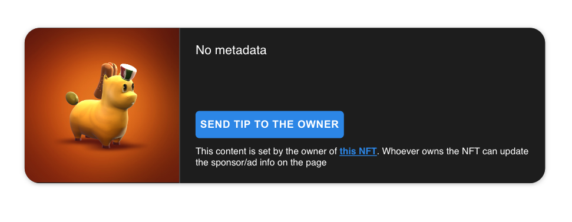

<br /><br />

# Embeddable NFTs

Easily embed NFT listings in your website!

### Demo
Demo : https://madtechnologistproton.github.io/x-nfts/example/
### Component inputs

`tokenAddress`\*- The token's contract address.

`baseIncomeStreamAddress`\*- The Base income stream contract address. Default is newest Base income stream contract : `0x3534955239dCebb283E23D8f02fe05B4cd5785e2`

`tokenId`\* - The token Id of the asset.

`infuraId`\* - Your Infura Id. Require in network `ethereum`, `goerli`

`horizontal` - If this is present, the card will be rendered horizontally.
mode on mobile (breakpoint is at 600px). In `manual` mode the card will be unaffected.

`orientationMode` - If `auto` the card will switch to vertical

`width` - The width of the embeddable. Ex. values `100%` `250px`. Default: `388px`

`height` - The height of the embeddable. Ex. values `40vh` `300px`. Default: `560px`

`network` - The name of the network the asset is on `ethereum` or `polygon`. Default: `ethereum`.

`mode` - Theme mode [`light`,`dark`]. Default: `light`


\*Required inputs

### Usage

Add this to your `<head>` tag:

```
<script src="https://madtechnologistproton.github.io/x-nfts/dist/x-card.min.js"></script>
```

Then add this into your code:

```
<x-card
  tokenAddress="0x5caebd3b32e210e85ce3e9d51638b9c445481567"
  tokenId="1"
  baseIncomeStreamAddress="0x3534955239dCebb283E23D8f02fe05B4cd5785e2"
  infuraId="YOUR_INFURA_ID"
  network="mainnet"
  >
</x-card>
```

### Development

For developers looking to contribute or modify the code, or view the example use the following commands:

```bash
  git clone https://github.com/madtechnologistproton/x-nfts.git
  cd x-nfts
  yarn install
  yarn run dev:demo
```

#### Development server

This project uses webpack for building and running a development server. Once the server starts, any changes made will trigger a rebuild after which those changes should be reflected in your browser.


#### Refer
> Refer from opensea embed code: https://github.com/ProjectOpenSea/embeddable-nfts